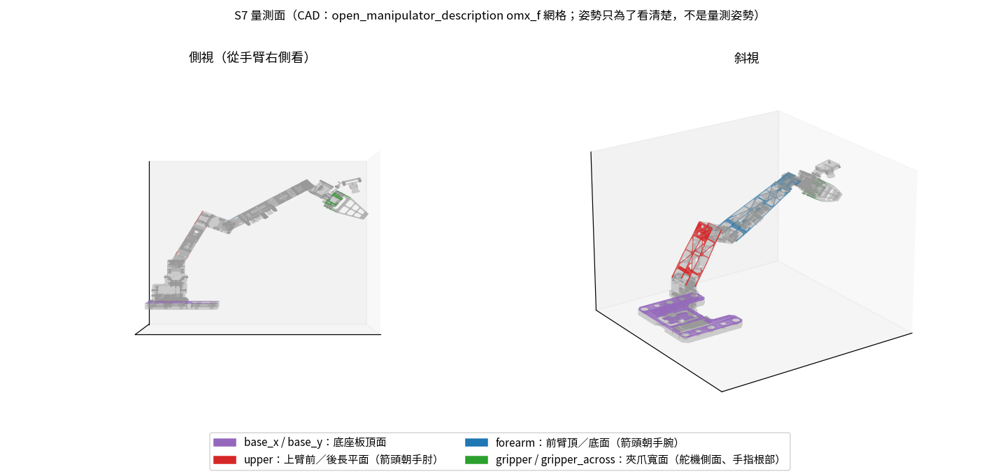

# S7 — 俯仰關節的零點與比例（實機，手機傾角儀貼連桿平面）

**目標腳本：`scripts/measure_link_tilt.py`**（`plan` / `session` / `solve` / `faces` / `selftest`）
**建立 2026-10-08。** 涵蓋 `shoulder_lift`、`elbow_flex`、`wrist_flex`、`wrist_roll`。`shoulder_pan` 不在這裡，見 S8。

> 這份設計成可以單獨帶到實驗室筆電執行。需要的 repo 檔案列在 §3。

---

## 1. 要解什麼問題

模擬裡的手臂在**靠近桌面時對得上，離桌面遠時對不上**，而且誤差會隨姿態改變：

| 證據 | 內容 |
|---|---|
| 10/08 手臂輪廓比對（`docs/meeting/2026-10-08_paper_to_pan.md`） | 低處姿態修正量 < 1 cm；高處姿態要的修正會隨姿態變 |
| 10/08 wrist_flex 逐幀擬合（77 幀，兩集一致） | home 需要 −22 到 −23°，夾取附近約 0° |
| `scripts/eval_joint_calibration.py`（2026-09-29） | 沒有任何一組零點能同時滿足「觸碰點」和「夾取高度」。觸碰點是扭力關、手托著記錄的，夾取是扭力開、手臂自己撐著 |
| 現行常數在觸碰點上 | 3D 誤差 6.1 cm，夾爪俯仰 113°（應為 90°） |

現行的零點**不是量出來的**：9/22 讓指尖碰座標紙上 11 個點擬合出來，之後再手調 lift +2°、wrist_flex +24°。
11 個點都在桌面上、夾爪都朝下，所以有很多組零點都能讓指尖碰到同樣的點，到了高處就各自分開。
9/21 的 S6 兩姿態法是用尺目測「大概垂直／鉛垂」`[Eric說 2026-10-08]`，精度不足以分開這幾種解。

**這份規格把三個俯仰關節加上 wrist_roll 的「讀值 → 角度」直接量出來，用的參考是重力，不需要桌面也不需要相機，所以高處姿態也能量。**

---

## 2. 量的是什麼（先讀這節）

### 2-1. 一筆讀數的定義

手機平貼在某段連桿的一個**平面**上，手機長邊沿著指定方向 `d`（CAD 裡那段連桿座標系的一個單位向量）。
讀數 = **手機長邊相對水平的角度，「箭頭端」較高為正**，範圍 −90..+90°。

- 「箭頭端」是長邊的哪一端，每個面都有指定（§4），例如前臂是「朝手腕那端」。
- 有些 App 在手機直立時顯示「與鉛垂的夾角」，這時要記 **90 − 該值**。`session` 會顯示現行常數的預測值，差超過 35° 會提醒你檢查。

### 2-2. 為什麼要問「往前還是往後傾」

俯仰面的讀數會轉成**手臂垂直面內的完整角度**（−180..180°，水平朝前為 0、往上為正）：

- 箭頭端朝手臂前方：角度 = 讀數
- 箭頭端朝後方（往底座）：角度 = ±180 − 讀數

只看讀數的話，「往下偏前 80°」和「往下偏後 80°」都讀成 −80。這正是 2026-09-29 那次把「傾過頭 23°」誤判成「差 23° 才到」的錯誤（`touch_calibrate.fingertip_pitch_deg`）。
讀數絕對值 ≥ 60° 時 `session` 會問你；小於 60° 時從預測值判斷，因為現行常數錯不到那麼多。

### 2-3. 模型

```
關節角(度) = 比例 × 讀值 + 零點          （lift、elbow、wrist_flex、wrist_roll 各一組）
預測讀數   = FK（reach_logger/fk.py，和模擬同一套）把 d 轉到世界座標後的角度
```

- **比例**由同一個平面在不同姿態之間的讀數差決定，CAD 的固定角會抵消掉。
- **零點**需要 CAD 的固定角，也就是「這個平面在連桿座標系裡朝哪邊」，由 §4 的網格分析提供。
- 量出來的零點會讓模擬裡的**連桿網格**和實機連桿傾斜一致，而渲染比對看的正是網格。

### 2-4. 為什麼量得出 9/21 量不出的東西

| | 9/21 S6 | S7 |
|---|---|---|
| 參考 | 尺目測「大概垂直」 | 手機傾角儀，正反各讀一次再平均 |
| 每個關節的姿態數 | 2 | 10 個姿勢一起擬合，涵蓋 home 到夾取 |
| CAD 固定角 | 用關節連線（上臂那 20.14° 沒定論） | 用網格上的實際平面 |
| 負載狀態 | 扭力關、手托著 | 扭力開、手臂自己撐著，和錄資料時一樣 |

`[已查證 2026-10-08，CAD]` 上臂的兩個長平面法向量是 ±x，所以**上臂本體在 joint2 = 0 時是垂直的**。
20.14° 只是 joint2 到 joint3 這條連線的傾角，不是上臂本體的傾角。這回答了 S6 §4-a「該不該扣 20.14°」的幾何問題：
量「上臂本體垂直」時，對應的是 joint2 = 0（S6 的「乙」）。實機和 CAD 是否一致`未確認`，S7 的量測本身會檢驗這件事。

---

## 3. 需要的東西

- **硬體**：OMX follower（通電、扭力開）、一支有傾角儀的手機。不需要 leader、相機或 GPU。
- **軟體**：實驗室筆電的 `uv` 環境。`plan`、`solve`、`faces`、`selftest` 任何有 numpy 的 Python 都能跑。
- **repo 檔案**：

| 檔案 | 用途 |
|---|---|
| `scripts/measure_link_tilt.py` | 本規格的腳本 |
| `configs/s7_link_tilt_plan_normalA1.json` | 姿勢計畫（已產生，§5），session 直接讀它，現場不需要資料集 |
| `reach_logger/fk.py`、`sim/joint_mapping.py`、`sim/omx_constants.py` | FK、現行常數、指尖位置 |
| `docs/assets/S7_measurement_faces.png` | 量測面的圖 |

---

## 4. 量測面



`[已查證 2026-10-08]` 從 URDF 用的 STL 網格（`open_manipulator_description/meshes/omx_f/`）找出的大平面。
`python scripts/measure_link_tilt.py faces --mesh-dir <meshes>` 可以重新算一次。
**模型只用到方向 `d`**，平板兩側的平面互相平行，所以哪一側都可以貼。

| 名稱 | 連桿 | 貼哪裡 | 手機長邊、箭頭端 | 網格依據 |
|---|---|---|---|---|
| `base_x` | 底座板 | 底座板頂面（肩關節旁的平板） | 前後方向，箭頭朝前 | `follower_01_base` 頂面 120×150 mm |
| `base_y` | 底座板 | 同上 | 左右方向，箭頭朝操作者左手邊 | 同上 |
| `upper` | 上臂 | 上臂前面或背面的長平面 | 沿上臂，箭頭朝手肘 | `follower_03` 法向 ±x，130×44.5 mm |
| `forearm` | 前臂 | 前臂頂面或底面 | 沿前臂，箭頭朝手腕 | `follower_04` 法向 ±z，172×44.5 mm |
| `gripper` | 夾爪本體（link5） | 夾爪寬面：腕部舵機側面，或手指根部的實心平面 | 沿夾爪，箭頭朝指尖 | `follower_06` 法向 ±z 19×33 mm；手指 `follower_07/08` 法向 ±z（手指繞 z 轉，任何開口都成立） |
| `gripper_across` | 夾爪本體 | 同一個寬面 | 橫跨夾爪，箭頭朝操作者左手邊 | 同上，`d` = link5 +y |

- 上臂和前臂在網格上是**鏤空框架**，手機會架在框的邊條上。邊條是共平面的，所以沒問題。
- 🔴 **`未確認`：這些面在實機上是否都摸得到、能讓手機貼平**（例如腕部相機支架可能擋住夾爪寬面）。
  第一次到現場時先拍一張手臂照片，對照上圖確認。若某個面不能用，在 `session` 裡跳過它即可，`solve` 只擬合看得到的參數。
- 手機長邊沒有完全對齊連桿時，誤差是二階的：偏 5° 只造成約 0.4%（cos 5°）的誤差。

---

## 5. 姿勢計畫（已產生，不需要重做）

```bash
python scripts/measure_link_tilt.py plan \
    --dataset-root data/huggingface/lerobot/ericc430/omx_pick_place_pilot_paper_cup_normal_A1 \
    --out configs/s7_link_tilt_plan_normalA1.json
```

- **姿勢全部取自 10/07 錄影時手臂真的到過的幀**，而且移動時**沿錄影的路徑走**（放慢 2 倍）。腳本不會自己規劃軌跡，這樣不會撞到東西。
- 挑選方法：在所有幀裡貪婪地選出最能分開「三個關節的零點和比例」的組合（D-optimal），再加上任兩個姿勢至少相差 10 單位的條件。結果有 10 個姿勢，涵蓋 home（P00、P07）、夾取附近（P02、P03）和高舉（P05、P06）。
- 指尖都在桌面上方 ≥ 5 cm（FK、現行常數）。路徑上夾爪的目標值不低於 50.5（兩指剛好接觸是 50.21），不會空夾硬擠。
- **背隙與負載測試**放在 P00（home）和 P05（最高點）：
  - lift、elbow 先往 ±4 單位偏移再回到原點，各量一次。
  - 前臂上手機「放著不托」量一次。
  - 偏移前已先檢查 ±4 單位後指尖仍離桌 ≥ 5 cm。
- **wrist_roll**：只有夾爪軸接近水平時，水平儀才看得到自轉。夾爪朝下時，自轉只會改變朝向，傾角不變。
  - 所以在起始姿勢把 wrist_flex 轉到 −41.2（往上、往前，遠離桌面），再把 roll 掃 5 點（±30 單位，約 ±54°）。

---

## 6. 現場步驟

1. 桌上的杯子拿走，收納盒可以留在原位（錄影時它就在那裡）。
2. 手臂移到計畫的起始姿勢（normal_A1 ep0 frame 0）：
   ```bash
   uv run python scripts/read_joint_pose.py --goto 0.07 -63.91 55.26 -1.20 -0.66 59.49
   ```
3. 先檢查手機：放在桌上讀一次，原地轉 180° 再讀一次。兩次相差超過 1°，換一支手機或換一個 App。
4. 開始量測：
   ```bash
   uv run python scripts/measure_link_tilt.py session \
       --plan configs/s7_link_tilt_plan_normalA1.json --csv calibration/<日期>_link_tilt.csv
   ```
   - 每次移動前都會停下來等 Enter。`s` 跳過這個姿勢，`q` 結束。已寫入的資料會保留，用同一個 CSV 再跑一次就會從中斷處繼續。
   - 每個面都要讀兩次：正著讀一次，手機在同一個面上轉 180° 再讀一次，兩次都以箭頭端為準。兩次差超過 2° 會提醒你重新貼好。
   - **手機用手托著、輕貼在面上**，不要讓手機的重量壓在手臂上（負載測試那幾筆例外，腳本會說）。
   - 結束時扭力保持開著，手臂停在起始姿勢。
5. 時間估計約 2–3 小時，已經乘過 2–3 倍。原始估計約 1 小時：10 個姿勢各約 3 分鐘，加上背隙、負載、roll 和準備。**請回報實際花了多久。**

⚠️ 這支 `session` **只在假手臂上跑過完整流程**（2026-10-08），還沒接過實機。它的匯流排操作沿用 `read_joint_pose.py --goto/--hold` 的寫法：先把 Goal 設成 Present 再開扭力、50 Hz 線性內插、結束時不關扭力。第一次執行時請手放在急停（電源）旁邊。

---

## 7. 求解與判讀

```bash
python scripts/measure_link_tilt.py solve --csv calibration/<日期>_link_tilt.csv \
    --touch-csv calibration/2026-09-22_touch_calibration.csv --out calibration/<日期>_link_tilt_fit.json --date <日期>
python3 scripts/eval_joint_calibration.py --candidate-json calibration/<日期>_link_tilt_fit.json
```

`solve` 會印出以下幾項：

1. **正反讀數差**的中位數：代表手機貼合的重複性，也就是量測的雜訊底線。
2. **現行常數的殘差**，依量測面分開列。
3. **兩種擬合**：
   - 只擬合零點（比例固定為 1.80°/unit）。
   - 零點加比例一起擬合。
   
   每種都附 RMS、留一姿勢交叉驗證的 RMS，以及每個參數的標準誤。
4. **線性檢查**：擬合後的殘差對各上游關節讀值的相關係數和彎曲量。
   - 明顯的斜率或彎曲，代表有「讀值 → 角度一條直線」解釋不了的東西：連桿變形、CAD 和實物不符，或齒輪背隙。
5. **背隙**：從 + 側和 − 側到達同一點的讀數差。
6. **負載**：手機放著不托 減 用手托著。
   - 這是編碼器看不到的連桿變形。
   - 大於 0.5° 代表手機重量本身就有影響。
7. **觸碰點交叉檢查**：只是參考。觸碰點是在扭力關的狀態下記錄的，和 S7 的負載狀態不同，這裡有差距可能是負載造成的，不一定是擬合錯。
8. **底座傾斜**：大於 0.5° 時，先把墊高台墊平再重量 B0，不要把傾斜值帶進常數裡。

**選哪一組貼回 `sim/joint_mapping.py`：**

- 預設用「只擬合零點」。
- 只有在以下兩個條件都成立時，才改用「零點＋比例」：
  - 它的留一交叉驗證 RMS 至少低 0.3°。
  - 擬合出的比例，其 95% 範圍（±2 個標準誤）不包含 1.80。
- 貼回常數之後，用 `scripts/fit_arm_overlay.py` 重跑 10/08 的手臂輪廓比對：home 和高處的幀要變好，低處不能變差。

---

## 8. 驗收條件

- [ ] 正反讀數差的中位數 ≤ 1°
- [ ] 擬合 RMS ≤ 1°，留一交叉驗證 RMS ≤ 1.5°。`推論`：這是依手機精度約 0.3–0.5° 加上貼合誤差訂的，如果實際雜訊底線更高，就依第 1 項的實測值調整
- [ ] 每個姿勢的殘差沒有一個超過 3°
- [ ] `eval_joint_calibration.py` 裡，新常數的夾取高度（crotch-rim）和放開位置（in-bin）都不比現行常數差
- [ ] 10/08 手臂輪廓比對中，home 和高處幀的 IoU 提高，低處不下降
- [ ] 量測 CSV 存進 `calibration/`，檔名帶日期，不覆寫

---

## 9. 明確不做、限制

- ❌ 不量 `shoulder_pan`：水平儀看不到繞鉛垂軸的轉動，pan 由 S8 處理。
- ❌ 不擬合連桿長度：如果量完每個關節都是漂亮的直線、殘差也小，但模擬畫面還是對不上，下一個嫌疑就是連桿長度或網格和實物不符。到那一步再另開規格。
- ❌ 不在腳本裡改 `joint_mapping.py`：腳本只印出常數，由人貼回去。理由同 S6：要能追溯是誰改的、根據哪次量測。
- 量到的零點包含「CAD 平面和實物平面的組裝差」。對模擬來說這正是要的，因為模擬畫的就是 CAD 網格；但它不是嚴格意義上「馬達的零點」。

## 10. 和其他規格的關係

- **S6**：S7 取代 S6 對這四個關節的量法。S6 的 CSV 和歷史保留不動。
- **S8**：互相獨立，可以同一天做，順序不拘。S8 比較快，建議先做。
- **S4 §5-5 T2（腕部相機外參）**：這兩份做完後再重做腕部 A、B 兩姿態。如果兩者的差距明顯縮小，就不需要在手臂上貼 ArUco 標記。
